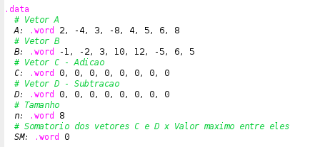
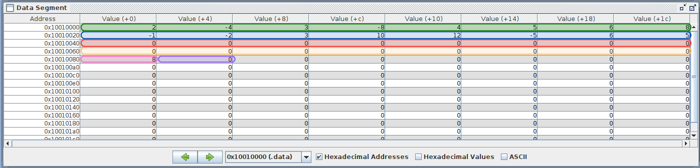
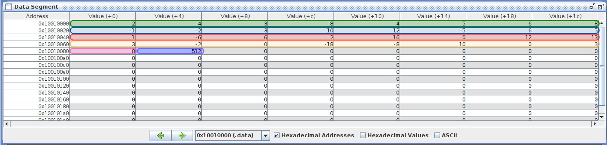

# Relatório do Trabalho Final de Sistemas Digitais

> Integrante: Bernardo Nilson

> Orientação: Prof. Edson Moreno

### Pseudocódigo, explicando o programa:

Trecho de código da Especificação Geral:

~~~java

// Crie dois vetores unidimensionais, A e B, cada um consistindo de n (onde n >= 8) inteiros aleatórios com sinal

int n = 8;
int [] A = {2, -4, 3, -8, 4, 5, 6, 8};
int [] B = {-1, -2, 3, 10, 12, -5, 6, 5};

// Crie dois vetores C e D com o mesmo número de elementos (n) dos vetores A e B. Todas as posições dos vetores C e D devem ser inicializados com zero.

int [] C = {0, 0, 0, 0, 0, 0, 0, 0};
int [] D = {0, 0, 0, 0, 0, 0, 0, 0};

// Adição de Vetores : 𝐶(𝑖) = 𝐴(𝑖) + 𝐵(𝑖)

// a. Crie uma sub-rotina em linguagem assembly que realize a adição de vetores.
// b. A sub-rotina deve receber os vetores de entrada A e B e armazenar o resultado em um novo vetor C.
// c. Use estruturas de looping apropriadas para iterar pelos vetores.

for (int i = n; i > 0; i--) {
    C[i] = A[i] + B[i];
}

// Subtração de Vetores : 𝐷(𝑖) = 𝐴(𝑖) − 𝐵(𝑖)

// a. Crie uma sub-rotina em linguagem assembly que realize a subtração de vetores.
// b. A sub-rotina deve receber os vetores de entrada A e B e armazenar o resultado em um novo vetor D.
// c. Use estruturas de looping apropriadas para iterar pelos vetores.

for (int i = n; i > 0; i--) {
    D[i] = A[i] - B[i];
}

~~~

Trecho de código da Especificação 3:

~~~java

// Crie uma sub-rotina que calcule o somatório de dois vetores multiplicado pelo valor máximo deles (SM → máximo vezes somatório).

// 𝑆𝑀 = max(𝐶,𝐷) . (∑𝐶𝑖 + ∑𝐷𝑖) = max(𝐶,𝐷) . (𝐶0 + 𝐶1 + 𝐶2 + ⋯ + 𝐶𝑛−1 + 𝐷0 + 𝐷1 + 𝐷2 + ⋯ + 𝐷𝑛−1)

// Calcule o somatório dos vetores C e D, que foram obtidos na ESPECIFICAÇÃO GERAL, multiplicado pelo valor máximo deles.

int sum = 0;
for (int i = n; i > 0; i--) {
    sum += C[i];
    sum += D[i];
}

int max = 0;
for (int i = n; i > 0; i--) {
    if (C[i] > max) max = C[i];
    if (D[i] > max) max = D[i];
}

// Salve o resultado em uma variável (SM) na memória.

int SM = 0;
for (int i = max; i > 0; i--) {
    SM += sum;
}

// Exemplo:
// • Considerando: 𝐶 = {10, 20, −5, 30} e 𝐷 = {2, 3, 4, −8}
// • 𝑆𝑀 = 30. ((10 + 20 + (−5) + 30) + (2 + 3 + 4 + (−8)) = 30(56) = 𝟏𝟔𝟖0

~~~

### Tabela relacionando variáveis e registradores:

| Variável do Pseudocódigo | Registrador do MIPS | Observação |
| -- | -- | -- |
| A | $s1 | Endereço do início do vetor |
| B | $s2 | Endereço do início do vetor |
| C | $s3 | Endereço do início do vetor |
| D | $s4 | Endereço do início do vetor |
| n | $s0 | Conteúdo de n |
| sum | $t9 | Conteúdo de sum |
| max | $t8 | Conteúdo de max |
| SM | $s7 | Conteúdo de SM |

### Área de dados, com a solução esperada:

Inicialmente, realizamos a soma e subtração de vetores A e B para gerar os vetores C e D:

C = { 1, -6, 6, 2, 16, 0, 12. 13 }

D = { 3, -2, 0, -18, -8, 10, 0, 3}

Após a execução da especificação geral, deve-se realizar a especificação do grupo (neste exemplo, a especificação 3):

SM = 16. ((1 + (−6) + 6 + 2 + 16 + 0 + 12 + 13) + (3 + (−2) + 0 + (-18) + (-8) + 10 + 0 + 3) = 16(32) = 512

### Telas do simulador MARS, com explicação;

Legenda:

a) Ilustrar a área de dados antes de iniciar a execução

b) Ilustrar a área de dados ao final da execução

